# Week 4 - Azure Cloud Fundamentals and Data Pipeline Implementation using Azure Data Factory

## 📌 Objective

The objective of this assignment is to understand Microsoft Azure cloud services by creating storage resources and implementing a complete data pipeline using Azure Data Factory (ADF). The pipeline reads a CSV file from Azure Blob Storage, validates its metadata, and copies it to another Blob Storage location.

---

## 🛠 Azure Services Used

- Microsoft Azure Portal
- Azure Resource Group
- Azure Storage Account
- Azure Blob Storage
- Azure Data Factory
- Azure IAM (Access Control)

---

# Task 1 – Resource Group

### Description

Created a Resource Group in Microsoft Azure to organize all resources used in this assignment.

### Screenshot

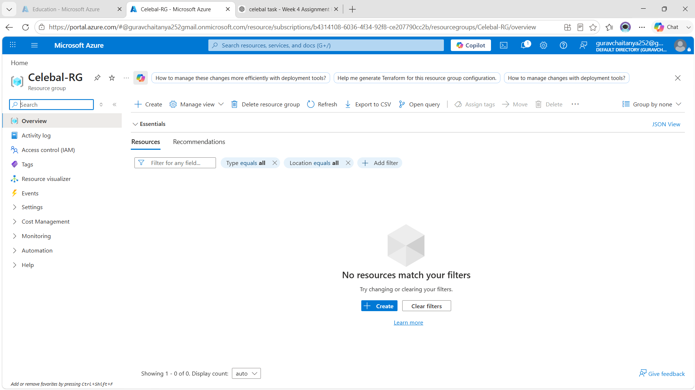

---

# Task 2 – Storage Setup

### Description

- Created an Azure Storage Account
- Created Blob Containers
- Uploaded the source CSV file

### Screenshots

#### Storage Account

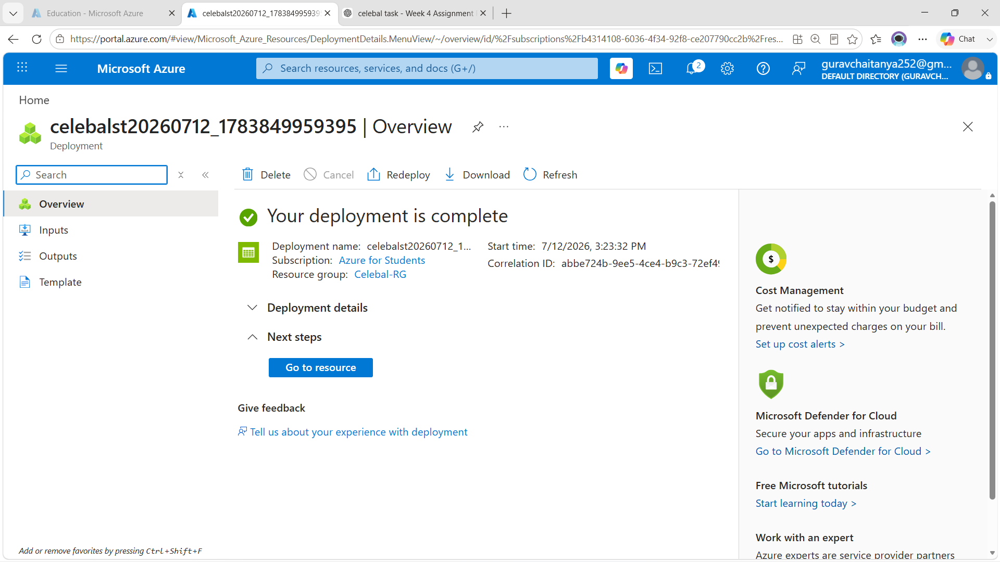

#### Blob Container

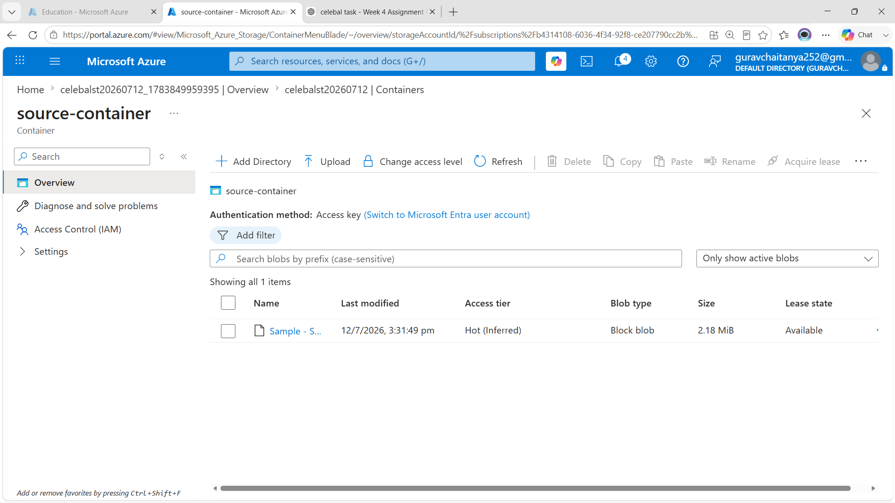

---

# Task 3 – Azure Data Factory Basics

### Description

Created Azure Data Factory and configured all required resources.

Completed:

- Linked Service
- Source Dataset
- Destination Dataset
- Get Metadata Activity

### Screenshots

#### Azure Data Factory

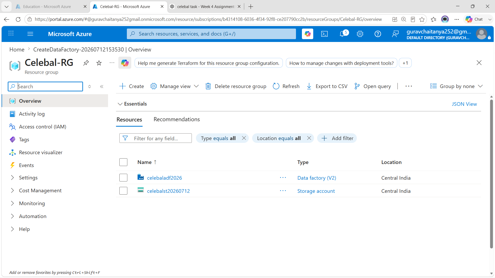

#### Linked Service

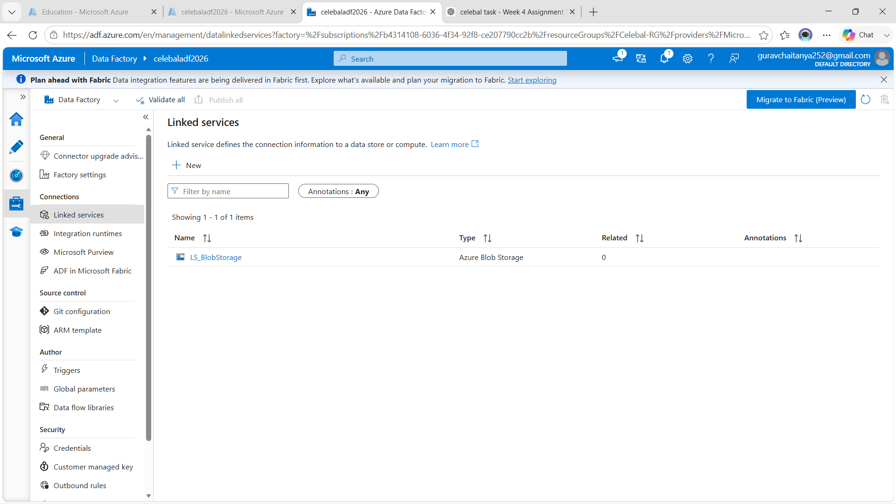

#### Source Dataset

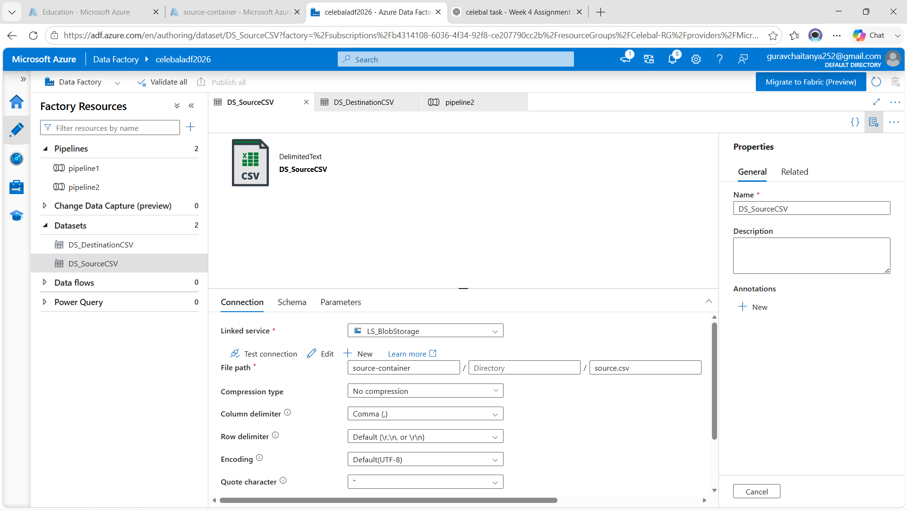

#### Destination Dataset

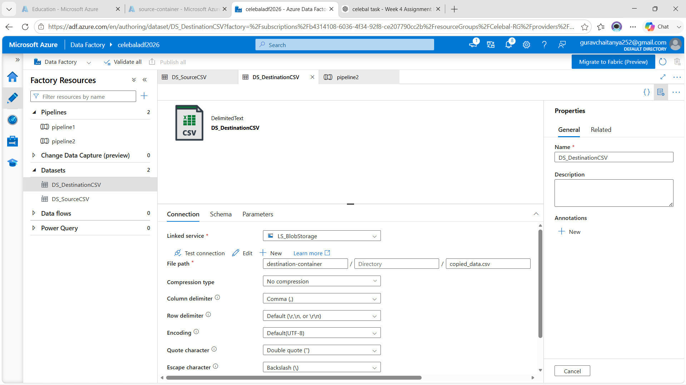

#### Get Metadata Configuration

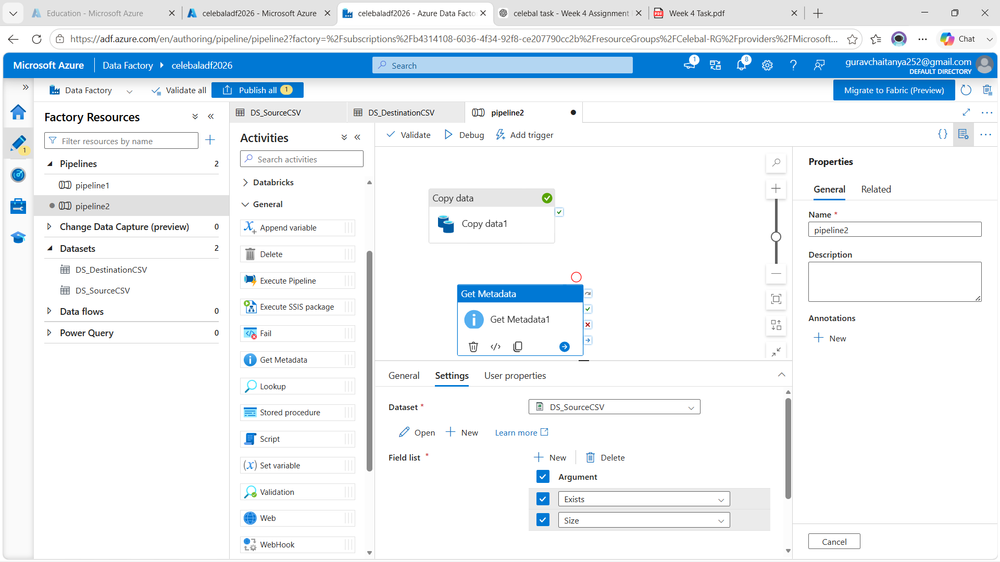

---

# Task 4 – Pipeline Development

### Description

Created an Azure Data Factory pipeline using:

- Copy Data Activity
- Get Metadata Activity

Configured source and destination datasets for copying the CSV file.

### Screenshot

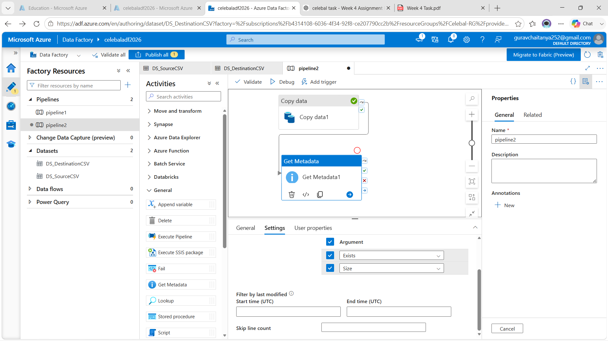

---

# Task 5 – Pipeline Execution

### Description

Executed the pipeline using Debug.

The pipeline completed successfully without errors.

### Screenshot

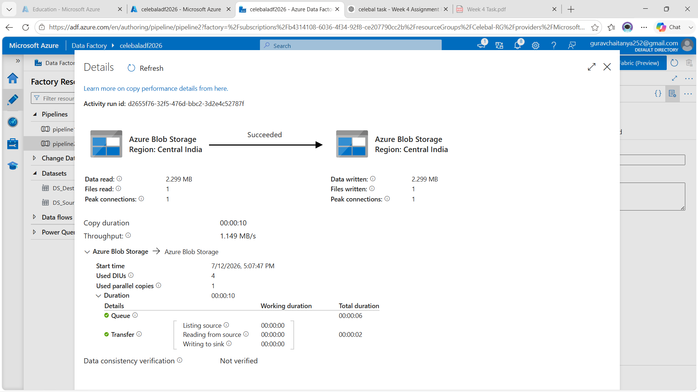

---

# Task 6 – IAM Role Assignment

### Description

Configured Azure IAM permissions by assigning the required roles to allow Azure Data Factory to access Blob Storage.

### Screenshot

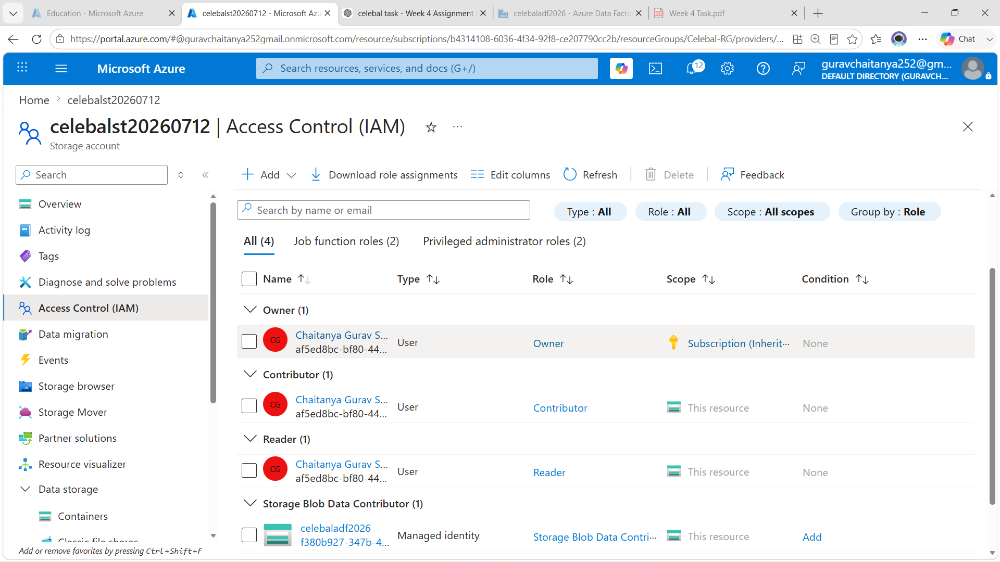

---

# 🚀 Mini Project

## Problem Statement

Build a complete Azure Data Factory pipeline that reads a CSV file from Azure Blob Storage, validates the file metadata, and copies the data to a new destination within Azure Blob Storage.

---

## Pipeline Workflow

Source CSV (Blob Storage)

↓

Linked Service

↓

Source Dataset

↓

Get Metadata Activity

↓

Copy Data Activity

↓

Destination Dataset

↓

Destination Blob Storage

---

## Expected Output

| Expected Output | Evidence |
|-----------------|----------|
| ✅ Pipeline executed successfully | **10_Pipeline_Success.png** |
| ✅ Data copied to destination | **10_Pipeline_Success.png** (Data Read = 2.299 MB, Data Written = 2.299 MB, Files Written = 1) |
| ✅ Metadata validated | **08_Get_Metadata_Settings.png** (Get Metadata configured with **Exists** and **Size**) |

### Supporting Screenshots

#### Get Metadata Activity

#### Pipeline Design

#### Successful Pipeline Execution

---

# ✅ Result

Successfully implemented an end-to-end Azure Data Factory pipeline that:

- Read a CSV file from Azure Blob Storage.
- Validated file metadata using the Get Metadata activity.
- Copied the data to a destination Blob container.
- Executed successfully without errors.

---

# 📚 Conclusion

This assignment provided practical experience with Microsoft Azure services, including Storage Accounts, Blob Storage, IAM, and Azure Data Factory. It demonstrated how to design, configure, and execute a cloud-based ETL pipeline using Azure Data Factory while validating metadata and securely transferring data between Blob Storage containers.
